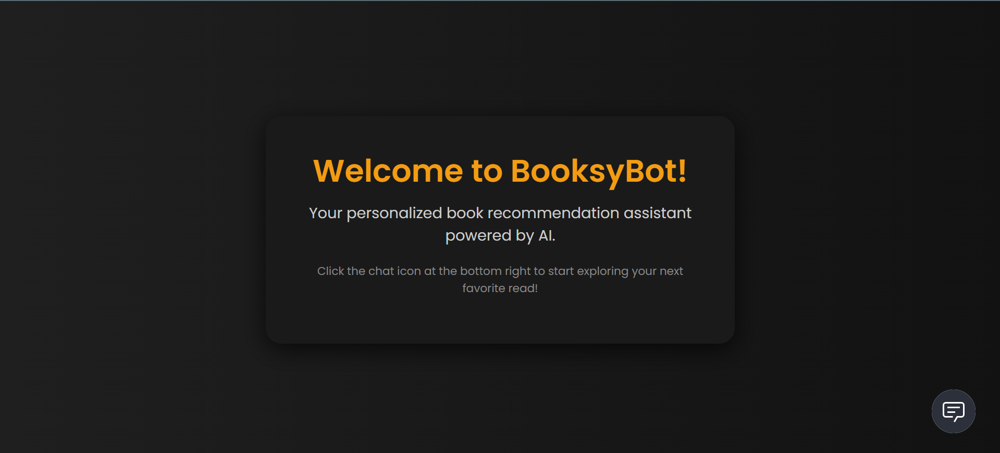
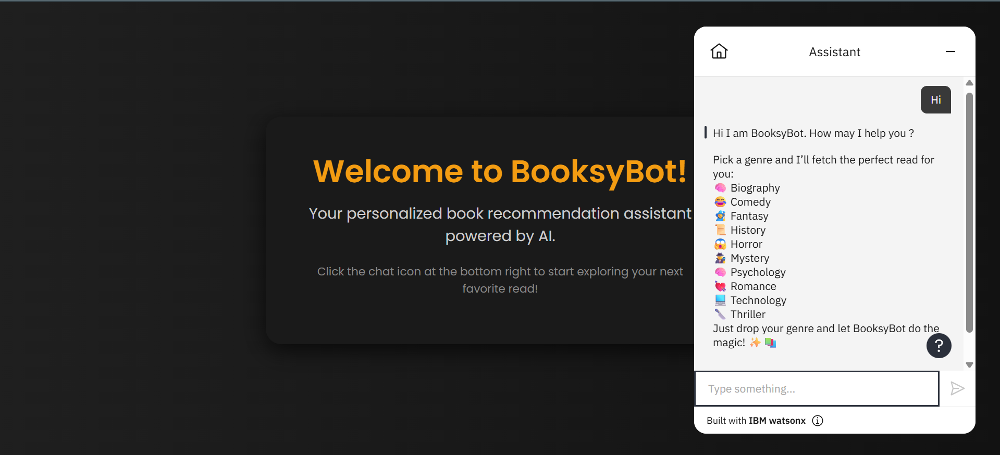

# BooksyBot — Your Reading Companion 📚🤖

Welcome to **BooksyBot** — an AI-powered book recommendation chatbot designed with a beautiful dark theme UI and powered by IBM Watson Assistant. This chatbot helps users discover great books based on their genre preferences.

---

## 🧠 Features

- 💬 Real-time book recommendations using IBM Watson Assistant
- 🎨 Dark-themed elegant UI for a smooth user experience
- ⚡ Responsive and minimalist landing page
- 🌐 Hosted via GitHub Pages

---

## 🖼️ Screenshots

### 💻 Landing Page

### 💬 Chatbot in Action

---

## 🛠️ Tech Stack

- **HTML5 + CSS3** (custom dark mode UI)
- **IBM Watson Assistant** for NLP-based chatbot
- **GitHub Pages** for deployment

---

## 👩‍💻 Author

Made with ❤️ by **Priyanshi Chauhan**

---

## 🌐 Deployment Instructions

If you want to deploy this yourself:

1. Fork or clone the repo
2. Make your edits in `index.html`
3. Push to `main` branch
4. Enable GitHub Pages via Settings → Pages → Source: `main` branch

---

✨ *Discover. Read. Repeat.* ✨  

